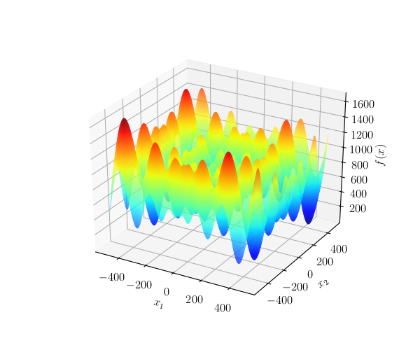
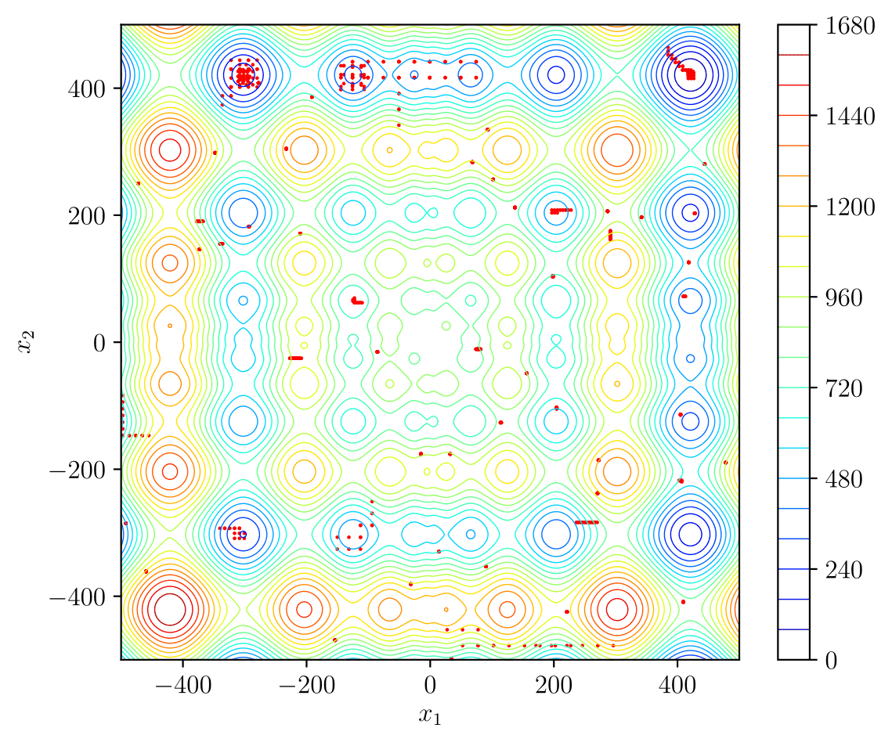
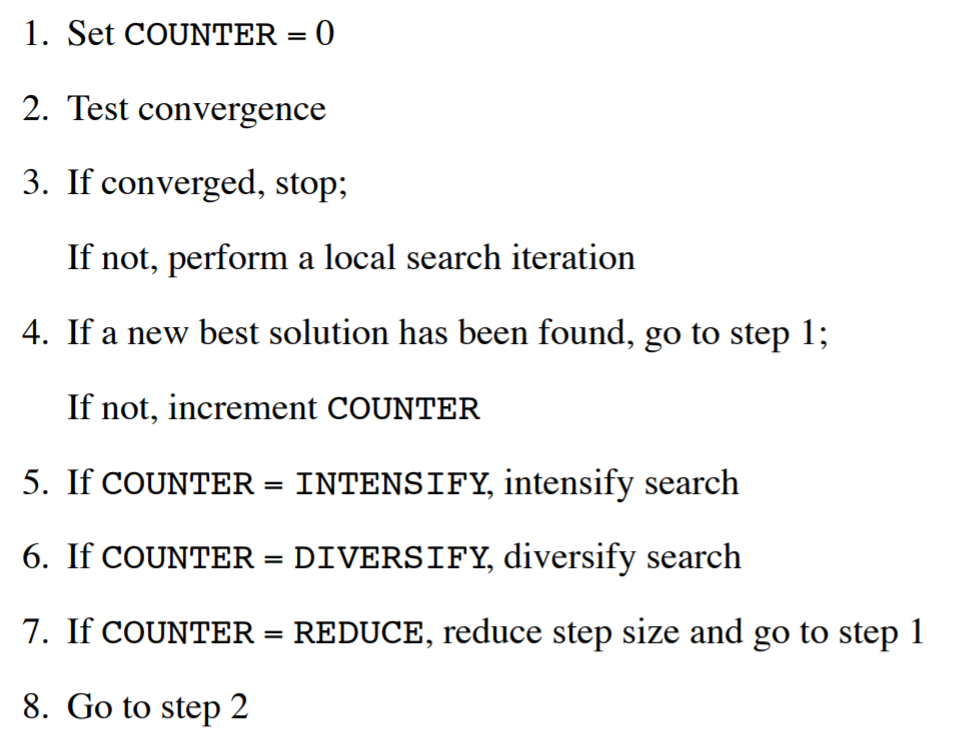
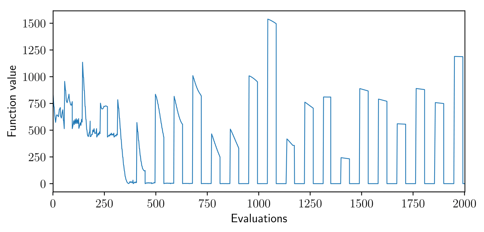
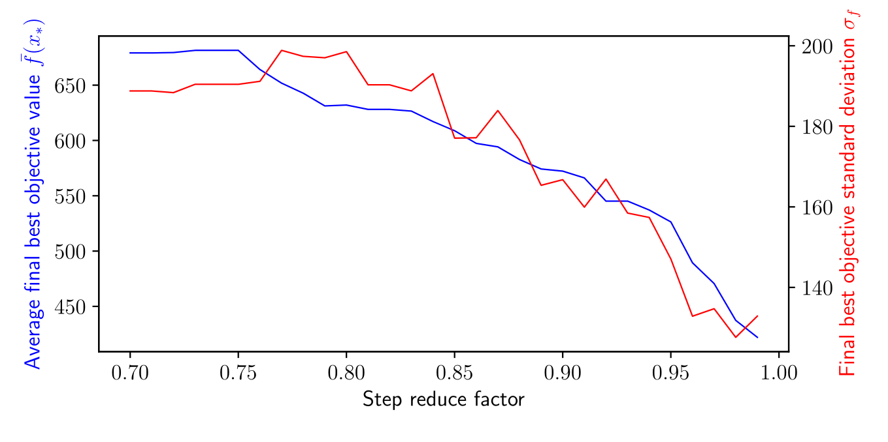
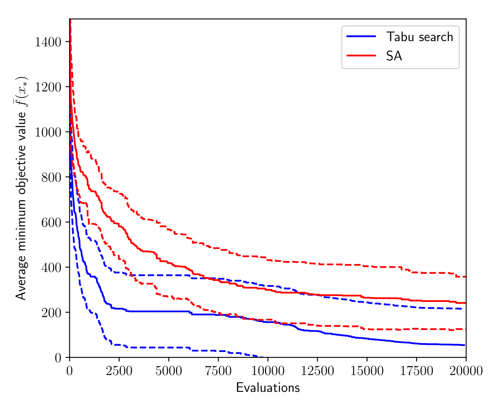

# Tabu Search

This is my implementation of Tabu Search: a gradient-free, stochastic global optimsation method which attempts to minimise a potentially multimodal objective function f(x) by taking discrete steps along the axis directions. I currently only have `tabusearch` set up to minimise the n-dimensional Schwefel function (shown below in its 2D form), but it can work with any function by extending the `Function` interface. The feasible region must be a hypercube centred on the origin.

The figure below shows a random path followed by `tabusearch` on the 2D Schwefel function which happens to locate the global optimum in the top right corner.

Three memory structures are used in Tabu Search. Short-term memory (STM) records the last N points visited. Points in the STM may not be revisited, thus forcing the search to move out of local minima in a different direction to the way it came. The medium-term memory (MTM) records the M best objective value points. When 'intensification' is triggered, the search moves to the Euclidian mean of the points in the MTM. I implement long-term memory (LTM) by dividing the feasible region into a grid. When 'diversification' is triggered, the search moves to a random point in the feasible region whose grid segment has not yet been visited by the search. If diversification does not improve things, the step size is reduced and the search restarts from the best solution found. Convergence occurs when the step size reduces below a threshold or after a certain number of objective function evaluations. 

The search logic uses a counter for the number of iterations without improvement to the best objective function value - see below (source: Dr Geoff Parks, 4M17 Practical Optimisation, Tabu Search handout).

I wrote this package as part of a coursework investigation for 4M17 Practical Optimisation (Cambridge University Engineering Department). As part of the investigation, I explored the effect of algorithm parameters on performance against the 5D Schwefel function, and compared it with another metaheuristic optimisation method (Simulated Annealing). For performance measures I used the mean and standard deviation of the best objective value found after 10,000 function evaluations over 50 runs with different random seeds. Some results from my report are shown below.

Evolution of the objective function value in the search versus the number of function evaluations for the 2D Schwefel function. 

Effect of the step reduce factor on the performance measures for the 5D Schwefel function.

Effect of the initial step size on the performance measures for the 5D Schwefel function.

Performance comparison between `tabusearch` and a MATLAB implementation of Simulated Annealing found online. The dotted lines show the +/- 1 standard deviation lines. This figure shows that my implementation of Tabu Seach outperforms the Simulated Annealing algorithm: the minimisation power is better at all stages in the search and the reliability is roughly the same.

