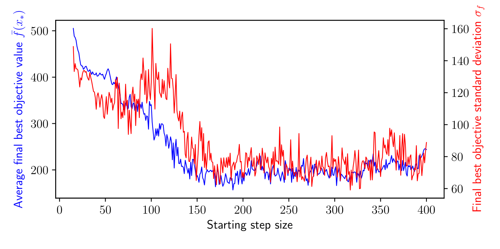

# What is this?

This is my implementation of Tabu Search: a gradient-free, stochastic global optimsation method which attempts to minimise a potentially multimodal objective function f(x) by taking discrete steps along the axis directions. I wrote this package as part of a coursework investigation for 4M17 Practical Optimisation (Cambridge University Engineering Department) during my Masters year. As part of the investigation, I explored the effect of algorithm parameters on the performance of Tabu Search and Simulated Annealing. I used the 5D Schwefel function as the objective function and compared the performance of the two optimisation methods after fine-tuning their parameters. I was awarded an A* (>75%) for my coursework report, which is included in this repository.

# Quick `tabusearch` run-through

Some examples with `tabusearch` are given in Java project/src/tabusearch/TSMain.java. The first task is to set up the static variables of the various classes to define the objective function and the algorithm parameters, for example:

```
Function myFunc = new Schwef(); // Using polymorphism to allow the objective function to be easily changed
final int dim = 5; // Input dimension
myFunc.setDim(dim); // Set the input dimension
Tabu.myFunc = myFunc; // Assign the objective function to be minised by Tabu Search
Tabu.dim = dim;
Tabu.verbose = false; // True: print progress events of the search.
Tabu.seed = 50; // Set the rng seed
Tabu.intensifyThresh = 10; // Counter limit to intensify search using MTM
Tabu.diversifyThresh = 15; // Counter limit to diversify search using long-term memory (LTM)
Tabu.ssrThresh = 25; // Counter limit to perform step-size reduction
Tabu.startingStepSize = 175; // Starting step size for the Tabu local search
Tabu.stepLimit = 1E-13; // Lower limit on the step size (>1E-13 to prevent double precision issues)
Tabu.stepReduceFactor = 0.985; // Constant factor to reduce stepSize by after step-size reduction
Tabu.evalLimit = 20000; // Convergence criterion - stop when # of function evaluations reaches evalLimit
Tabu.stmSize = 8; // Short-term memory (STM) size
MTM.mtmSize = 4; // Medium-term memory (MTM) size
Tabu.constraint = 500.0; // Hypercube feasible region: upper limit on variable magnitude
LTM.setSegSize(100.0); // Long-term memory (LTM) segment size for grid
```

To perform a search, simply instantiate a `Tabu` object and run its `doTabuSeach` method:

```
Tabu tabuObj = new Tabu();
tabuObj.doTabuSearch();
```

One can investigate the effects of algorithm parameters by running the above within a loop. Making the Tabu class instantiatiable ensures independence between successive runs of the algorithm. 

After running, the Tabu object stores the following data in `LinkedList` memory objects:

* `globSearchHist`: Evolution of `Point` objects storing the input x and function value f(x)
* `numEvalEvolution`: Evolution of the number of function evaluations
* `globfEvolZeroHold`: Evolution of the objective value zero-held with the # of function evaluations
* `globMinValZeroHold`: Evolution of the *best* objective value found in the search (also zero-held). The final element of this list is therefore the overall best objective value that the search could find.

The Tabu object also stores `bestSolution` - a `Point` object corresponding to the best solution. A simple but useful extension to `tabusearch` would be a user choice of what data to store in Tabu objects, which would provide an efficiency boost when many runs are occurring and certain data need not be stored.

# The Tabu Search algorithm

I currently only have `tabusearch` set up to minimise the n-dimensional Schwefel function (shown below in its 2D form), but it can work with any function by extending the `Function` interface (as in `Scwef.java`). The feasible region must be a hypercube centred on the origin.


The figure below shows a random path followed by `tabusearch` on the 2D Schwefel function which happens to locate the global optimum in the top right corner.


This figure shows the evolution of the objective function value versus the number of function evaluations for the 2D Schwefel function. 


Three memory structures are used in Tabu Search. Short-term memory (STM) records the last N points visited. Points in the STM may not be revisited, thus forcing the search to move out of local minima in a different direction to the way it came. The medium-term memory (MTM) records the M best objective value points. When 'intensification' is triggered, the search moves to the Euclidian mean of the points in the MTM. I implement long-term memory (LTM) by dividing the feasible region into a grid. When 'diversification' is triggered, the search moves to a random point in the feasible region whose grid segment has not yet been visited by the search. If diversification does not improve things, the step size is reduced and the search restarts from the best solution found. In `tabusearch`, convergence occurs after a defined number of objective function evaluations. An alternative criterion is when the step size reduces below a certain threshold. 

The search logic uses a counter for the number of iterations without improvement to the best objective function value - see below (source: Dr Geoff Parks, 4M17 Practical Optimisation, Tabu Search handout).


# Investigation

For the investigation I used the mean and standard deviation of the best objective value found after 10,000 function evaluations over 50 runs (with different random seeds) as performance measures. Some results from my report are shown below.

Effect of the step reduce factor on the performance measures for the 5D Schwefel function.


Effect of the initial step size on the performance measures for the 5D Schwefel function.



Performance comparison between `tabusearch` and a MATLAB implementation of Simulated Annealing found online. The dotted lines show the +/- 1 standard deviation lines. This figure shows that my implementation of Tabu Seach outperforms the Simulated Annealing algorithm for the 5D Schwefel function: the minimisation power is better at all stages in the search and the reliability is roughly the same.


